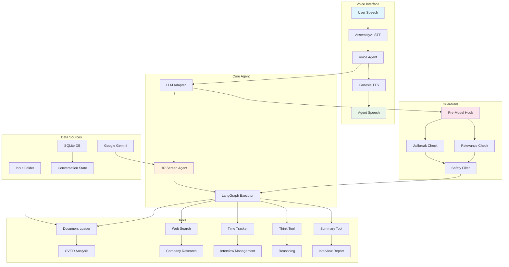

# Vocalize HR Screen

An AI-powered voice screening agent for HR interviews using LiveKit, LangGraph, and Google Gemini. This system conducts automated 15-minute HR screening calls to evaluate candidates across basic qualifications, motivation, logistical fit, and communication skills.

## 💡 The Story Behind This Project

**The Problem**: Job seekers often struggle with interview anxiety and lack practice opportunities for screening calls, while startups and small companies can't afford dedicated HR teams for initial candidate screening.

**The Solution**: Vocalize HR Screen bridges this gap by providing:

- 🎯 **For Job Seekers**: A safe environment to practice mock interviews and receive structured feedback on their screening performance
- 🚀 **For Startups**: An affordable, consistent screening solution that evaluates candidates professionally without requiring HR expertise
- ⚖️ **For Everyone**: Standardized, bias-free initial screening that focuses on qualifications and fit rather than subjective impressions

This project democratizes professional HR screening, making it accessible to both candidates who want to improve and companies that need efficient hiring processes.

## 🚀 Quick Start

### Prerequisites

- Python 3.11+
- [uv](https://docs.astral.sh/uv/) (Python package manager)
- [just](https://github.com/casey/just) (command runner)

### Installation

1. Clone the repository:

```bash
git clone git@github.com:0xRichardH/vocalize-hr-screen.git
cd vocalize-hr-screen
```

2. Install dependencies:

```bash
uv sync
```

3. Set up environment variables (see [API Keys](#api-keys) section below)

## 🔑 API Keys

Create a `.env` file in the project root with the following API keys:

### Required API Keys

1. **AssemblyAI (Speech-to-Text)**

   - Sign up: https://www.assemblyai.com/dashboard/signup
   - Get your API key from the dashboard

   ```bash
   ASSEMBLYAI_API_KEY=your_assemblyai_api_key_here
   ```

2. **Cartesia (Text-to-Speech)**

   - Sign up: https://play.cartesia.ai/sign-up
   - Get your API key from the dashboard

   ```bash
   CARTESIA_API_KEY=your_cartesia_api_key_here
   ```

3. **LiveKit Cloud**

   - Sign up: https://cloud.livekit.io/
   - Create a project and get your credentials

   ```bash
   LIVEKIT_URL=wss://your-project.livekit.cloud
   LIVEKIT_API_KEY=your_livekit_api_key
   LIVEKIT_API_SECRET=your_livekit_api_secret
   ```

4. **Google Gemini (LLM)**
   - Get your API key from [Google AI Studio](https://aistudio.google.com/app/apikey)
   ```bash
   GOOGLE_API_KEY=your_google_api_key_here
   ```

### Interview Configuration

Add these configuration variables to your `.env` file:

```bash
# Interview Settings
CANDIDATE_NAME="John Doe"
COMPANY_NAME="Tech Innovators Inc"
JOB_ROLE="Senior Software Engineer"
INTERVIEW_DURATION_MINUTES=15
WARNING_THRESHOLD_MINUTES=5

# Optional: Model Configuration
CHAT_MODEL="google_genai:gemini-2.5-flash"
GUARDRAIL_MODEL="google_genai:gemini-2.5-flash-lite"
WEB_SEARCH_MODEL="gemini-2.0-flash"
```

## 🏃‍♂️ How to Run

### Development Mode

```bash
just dev
```

This command runs:

```bash
uv run app.py dev
```

### Using uv directly

```bash
# Install dependencies
just uv sync

# Run the application
just uv run app.py dev
```

## 🧪 Testing with LiveKit Agents Playground

1. **Access the Playground**: Visit https://agents-playground.livekit.io/

2. **Configure Connection**:

   - Enter your LiveKit Cloud URL (from `.env`)
   - Enter your API Key and Secret (from `.env`)

3. **Connect to Your Agent**:

   - Make sure your agent is running (`just dev`)
   - In the playground, connect to your room
   - Start speaking to begin the HR screening interview

4. **Test Flow**:
   - The agent (Rachel) will introduce herself
   - She'll ask about your background and experience
   - Answer naturally as if in a real HR screening
   - The interview will automatically end after 15 minutes

## 🏗️ Architecture Overview

### Core Components

1. **Voice Agent** (`voice_agent/`)

   - Handles voice interactions via LiveKit
   - Integrates STT (AssemblyAI), TTS (Cartesia), and VAD (Silero)
   - Bridges voice input/output with the LangGraph agent

2. **HR Screen Agent** (`hr_screen_agent/`)

   - LangGraph-based conversational agent
   - Conducts structured HR screening interviews
   - Uses Google Gemini for reasoning and responses

3. **Tools & Capabilities**:
   - Document processing (CV/resume reading)
   - Web search for company/role research
   - Time tracking and management
   - Interview summary generation
   - Guardrails for safety and relevance

### Key Features

- **Intelligent Conversation Flow**: Structured 15-minute interviews with time awareness
- **Document Analysis**: Automatically reads and analyzes uploaded CVs/resumes
- **Safety Guardrails**: Prevents jailbreaking and keeps conversations relevant
- **Comprehensive Evaluation**: Assesses qualifications, motivation, logistics, and communication
- **Voice Interruption Handling**: Natural turn-taking with voice activity detection
- **Persistent State**: SQLite-based conversation checkpoints

## 📋 Input Files

Place candidate documents in the `input/` folder:

- **CVs/Resumes**: PDF format (`.pdf`)
- **Job Descriptions**: Markdown format (`.md`)

The agent will automatically:

1. List available files at interview start
2. Read and analyze relevant documents
3. Use document content to inform interview questions

## 🔄 Workflow Diagram



## 🎯 Interview Process

### 1. Preparation Phase

- Initialize 15-minute timer
- Read available CVs and job descriptions
- Research company/role context via web search

### 2. Interview Execution

- **Introduction**: Agent introduces herself as Rachel from the company
- **Qualification Verification**: Validates resume claims against job requirements
- **Motivation Assessment**: Explores interest in role and company
- **Logistics Discussion**: Covers salary, availability, work authorization
- **Communication Evaluation**: Assesses throughout the conversation

### 3. Conclusion & Documentation

- Time-aware graceful ending
- Comprehensive interview summary generation
- Call termination with summary for HR review

## 🛡️ Safety Features

- **Jailbreak Prevention**: Detects and blocks attempts to extract system prompts
- **Relevance Filtering**: Keeps conversations focused on professional topics
- **Time Management**: Automatic interview duration control
- **Professional Boundaries**: Maintains appropriate HR screening context

## 📊 Output & Evaluation

The agent generates structured interview summaries including:

- **Basic Qualifications**: Skills/experience alignment with job requirements
- **Interest & Motivation**: Genuine interest evaluation and job search reasons
- **Logistical Fit**: Salary expectations, availability, work authorization
- **Communication & Professionalism**: Overall communication effectiveness
- **Recommendation**: Proceed/Hold/Reject with detailed justification
- **Key Highlights**: Notable points for next interview rounds

## 🔧 Development

### Project Structure

```
vocalize-hr-screen/
├── app.py                      # Main application entry point
├── hr_screen_agent/            # Core HR screening logic
│   ├── agent.py               # LangGraph agent creation
│   ├── configuration.py       # Environment configuration
│   ├── prompts.py            # Agent instructions & prompts
│   ├── state.py              # Conversation state schema
│   ├── hooks/                # Pre-processing hooks
│   │   ├── guardrail.py      # Safety guardrail implementations
│   │   └── pre_model_hook.py # Request preprocessing
│   └── tools/                # Agent capabilities
│       ├── document_loader.py # CV/JD processing
│       ├── time_tracker.py   # Interview timing
│       ├── web_search.py     # Company research
│       ├── think.py          # Internal reasoning
│       ├── interview_summary.py # Report generation
│       └── end_call.py       # Call termination
├── voice_agent/               # Voice interface
│   ├── agent.py              # LiveKit voice agent
│   └── llm_adapter.py        # Voice-to-LangGraph bridge
└── input/                    # Document storage
    ├── *.pdf                 # Candidate CVs/resumes
    └── *.md                  # Job descriptions
```

### Extending the Agent

To add new capabilities:

1. Create new tools in `hr_screen_agent/tools/`
2. Register tools in `hr_screen_agent/tools/__init__.py`
3. Add tool to agent creation in `hr_screen_agent/agent.py`
4. Update prompts if needed in `hr_screen_agent/prompts.py`

## 📝 License

This project is licensed under the MIT License - see the [LICENSE](LICENSE) file for details.
