_This is a submission for the [AssemblyAI Voice Agents Challenge](https://dev.to/challenges/assemblyai-2025-07-16)_

## What I Built

**Vocalize HR Screen** is an intelligent voice-powered HR screening agent that conducts professional 15-minute interviews to evaluate candidates across four key areas: basic qualifications, motivation, logistical fit, and communication skills.

### 💡 The Inspiration

As someone who has experienced both sides of the hiring process, I noticed two critical pain points:

**For Job Seekers**: Many talented candidates struggle with interview anxiety and lack access to realistic practice opportunities. They often get rejected at the screening stage not because they're unqualified, but because they couldn't effectively communicate their value in a high-pressure situation.

**For Startups**: Small companies and startups often lack dedicated HR teams or the resources to conduct consistent, professional screening interviews. This leads to either skipped screening (resulting in wasted time on unqualified candidates) or inconsistent evaluation processes.

### 🎯 The Vision

Vocalize HR Screen solves both problems:

- **📚 Mock Interview Platform**: Job seekers can practice realistic HR screening scenarios, receive detailed feedback, and build confidence before real interviews
- **🏢 Startup HR Solution**: Small companies get access to professional-grade screening capabilities without hiring expensive HR personnel
- **⚖️ Standardized Evaluation**: Ensures consistent, bias-free screening focused on qualifications rather than subjective impressions

This democratizes professional HR processes, making quality screening accessible to everyone.

### 🤖 Technical Implementation

Built for the **Business Automation** category, this solution automates the time-consuming initial HR screening process while maintaining the human touch through natural voice conversations. The agent acts as "Rachel," a professional HR recruiter who can:

- 🎯 Conduct structured, time-aware interviews
- 📄 Automatically analyze candidate CVs and job descriptions
- 🌐 Research company context in real-time
- 🛡️ Maintain professional boundaries with built-in guardrails
- 📊 Generate comprehensive evaluation reports
- ⏱️ Manage interview flow with precise timing

The system combines cutting-edge voice AI with intelligent conversation management to scale HR processes without losing the personal connection that's crucial in recruitment.

## Demo

🔗 **GitHub Repository**: [https://github.com/0xRichardH/vocalize-hr-screen](https://github.com/0xRichardH/vocalize-hr-screen)

### Live Demo Video

https://youtu.be/tmtbF_k2cPI

### Demo Flow Screenshots

**Interview Setup & Document Analysis:**

- Agent automatically reads candidate CV and job description
- Initializes 15-minute timer for structured interview

**Natural Voice Conversation:**

- Professional introduction as "Rachel" from the company
- Intelligent follow-up questions based on resume analysis
- Real-time company research for contextual questions

**Comprehensive Evaluation:**

- Automated summary generation with detailed assessment
- Structured recommendations for next interview rounds
- Professional call termination with clear next steps

## GitHub Repository



**Key Repository Highlights:**

- 📁 Well-structured codebase with clear separation of concerns
- 📚 Comprehensive documentation and setup instructions
- 🔧 Easy configuration through environment variables
- 🧪 Ready-to-test with LiveKit Agents Playground
- 📝 MIT License for open source collaboration

## Technical Implementation & AssemblyAI Integration

### AssemblyAI Universal-Streaming Integration

The core of our voice processing leverages **AssemblyAI's Universal-Streaming technology** for superior speech recognition with advanced turn detection:

```python
# voice_agent/agent.py
from livekit.plugins import assemblyai

class VoiceAgent(Agent):
    def __init__(self, agent: PregelProtocol, thread_id: str) -> None:
        super().__init__(
            instructions="",
            llm=LLMAdapter(
                graph=agent,
                config={"configurable": {"thread_id": thread_id}}
            ),
            # AssemblyAI's advanced turn detection
            stt=assemblyai.STT(
                end_of_turn_confidence_threshold=0.7,
                min_end_of_turn_silence_when_confident=160,
                max_turn_silence=2400,
            ),
            tts=cartesia.TTS(
                language="en",
                speed="normal",
            ),
            vad=silero.VAD.load(),  # Voice Activity Detection
            turn_detection="stt",  # Use AssemblyAI's STT-based turn detection
            allow_interruptions=True,
        )
```

### Key AssemblyAI Features Leveraged

**1. Intelligent Turn Detection**

- `end_of_turn_confidence_threshold=0.7`: Ensures natural conversation flow
- `min_end_of_turn_silence_when_confident=160ms`: Quick response times
- `max_turn_silence=2400ms`: Handles thoughtful pauses during interviews

**2. Professional Voice Processing**

```python
# Advanced configuration for interview scenarios
stt=assemblyai.STT(
    # Optimized for professional conversations
    end_of_turn_confidence_threshold=0.7,
    # Quick turn-around for responsive dialogue
    min_end_of_turn_silence_when_confident=160,
    # Allows for candidate thinking time
    max_turn_silence=2400,
)
```

**3. Real-time Streaming Architecture**
The system processes voice input through AssemblyAI's streaming API, enabling:

- Immediate response to candidate speech
- Natural interruption handling during conversations
- Seamless integration with LiveKit's real-time infrastructure

### Technical Architecture

**System Architecture Overview:**

```mermaid
graph TB
    subgraph "User Interface"
        A["👤 Candidate<br/>Voice Input"] --> B["🎙️ AssemblyAI STT<br/>Speech Recognition"]
        H["🔊 Cartesia TTS<br/>Text-to-Speech"] --> I["🗣️ Agent Voice<br/>Output"]
    end

    subgraph "LiveKit Voice Processing"
        B --> C["🎵 Voice Agent<br/>LiveKit Integration"]
        C --> D["🔀 LLM Adapter<br/>Voice ↔ LangGraph Bridge"]
        G --> H
        D --> G["📝 Voice Response<br/>Generation"]
    end

    subgraph "Core AI Agent"
        D --> E["👩‍💼 HR Screen Agent<br/>LangGraph Executor"]
        E --> F["🧠 Google Gemini<br/>LLM Reasoning"]
        F --> E
    end

    subgraph "Safety & Guardrails"
        J["🛡️ Pre-Model Hook<br/>Request Processing"] --> K["🚫 Jailbreak Guard<br/>Security Check"]
        J --> L["🎯 Relevance Guard<br/>Topic Validation"]
        K --> M["✅ Safety Filter<br/>Approved Requests"]
        L --> M
    end

    subgraph "Agent Tools & Capabilities"
        N["📄 Document Loader<br/>CV/Resume Analysis"] --> O["📊 Qualification<br/>Assessment"]
        P["🌐 Web Search<br/>Company Research"] --> Q["🏢 Context<br/>Gathering"]
        R["⏱️ Time Tracker<br/>Interview Management"] --> S["📅 Schedule<br/>Control"]
        T["🤔 Think Tool<br/>Internal Reasoning"] --> U["💭 Decision<br/>Making"]
        V["📝 Summary Tool<br/>Report Generation"] --> W["📋 Interview<br/>Evaluation"]
    end

    subgraph "Data Storage"
        X["📁 Input Folder<br/>CVs & Job Descriptions"] --> N
        Y["💾 SQLite Database<br/>Conversation State"] --> Z["🔄 Session<br/>Persistence"]
        AA["☁️ Google Gemini API<br/>LLM Services"] --> F
    end

    D --> J
    M --> E
    E --> N
    E --> P
    E --> R
    E --> T
    E --> V

    style A fill:#e3f2fd
    style I fill:#e8f5e8
    style E fill:#fff3e0
    style J fill:#fce4ec
```



**Voice-to-Intelligence Pipeline:**

```python
# voice_agent/llm_adapter.py
class LangGraphStream(llm.LLMStream):
    async def _run(self) -> None:
        state = self._chat_ctx_to_state()

        # Stream through LangGraph for intelligent processing
        async for output in self._graph.astream(
            state, self._config, stream_mode="updates"
        ):
            updates = next(iter(output.values()))
            if not updates:
                continue
            last_message = updates["messages"][-1]

            chat_chunk = _to_chat_chunk(last_message)
            if chat_chunk:
                self._event_ch.send_nowait(chat_chunk)
```

**Intelligent Agent Integration:**

```python
# hr_screen_agent/agent.py
def create_hr_screen_agent(
    checkpointer: Optional[Checkpointer] = None, debug: bool = False
) -> PregelProtocol:
    return create_react_agent(
        name="hr_screen_agent",
        model=llm,
        state_schema=HrScreenAgentState,
        pre_model_hook=pre_model_hook,  # Safety guardrails
        tools=[
            think, web_search, read_input_file,
            start_timer, check_time_remaining,
            write_interview_summary, end_call,
        ],
        prompt=agent_instructions,
        checkpointer=checkpointer,  # Persistent conversation state
        debug=debug,
    )
```

### Advanced Features

**1. Context-Aware Processing**

- Document analysis integration with voice responses
- Real-time web search for company research
- Persistent conversation state across interview sessions

**2. Professional Safety Guardrails**

```python
# hr_screen_agent/hooks/pre_model_hook.py
async def pre_model_hook(state: HrScreenAgentState, config: RunnableConfig):
    # Jailbreak prevention
    jailbreak_result = await jailbreak_guardrail(llm, last_messages)
    if not jailbreak_result.is_safe:
        return Command(goto="agent", update={"messages": safety_response})

    # Relevance filtering for professional context
    relevance_result = await relevance_guardrail(llm, last_messages)
    if not relevance_result.is_relevant:
        return Command(goto="agent", update={"messages": redirect_response})
```

**3. Time-Aware Interview Management**

```python
# Intelligent time tracking with AssemblyAI streaming
async def check_time_remaining():
    elapsed = (datetime.now(timezone.utc) - state["start_time"]).total_seconds() / 60
    remaining = interview_duration - elapsed

    if remaining <= warning_threshold:
        return f"⚠️ Warning: Only {remaining:.1f} minutes remaining"
```

### Why AssemblyAI Was Essential

**Superior Speech Recognition**: AssemblyAI's Universal-Streaming technology provides the accuracy needed for professional interviews where every word matters.

**Natural Conversation Flow**: The advanced turn detection enables natural back-and-forth dialogue essential for effective HR screening.

**Real-time Performance**: Streaming capabilities ensure responsive interactions that feel human-like rather than robotic.

**Professional Reliability**: Enterprise-grade accuracy and reliability required for business-critical HR processes.

This technical implementation showcases how AssemblyAI's cutting-edge voice technology can be leveraged to create sophisticated business automation solutions that maintain the human touch while scaling professional processes.

---

_Built with 💙 using AssemblyAI, LiveKit, LangGraph, and Google Gemini_
